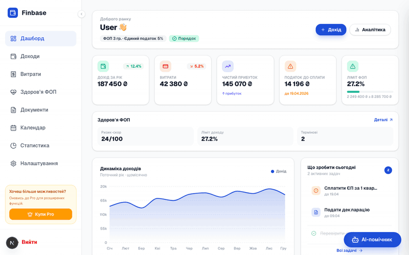
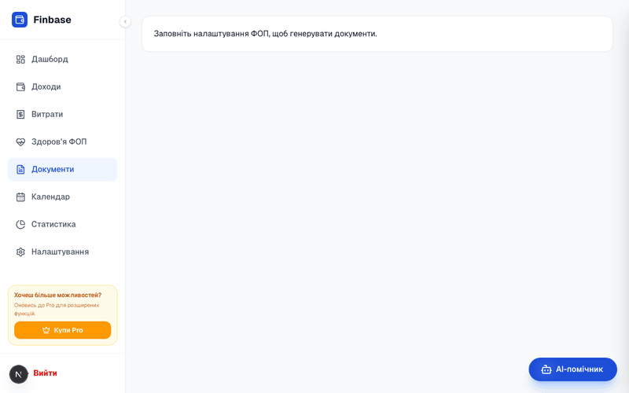
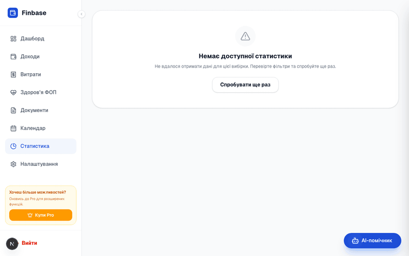

<p align="center">
  
</p>

<h1 align="center">Finance Base</h1>

<p align="center">
  <strong>All-in-one financial dashboard for Ukrainian sole proprietors (ФОП)</strong><br/>
  Income tracking · Tax calculation · Document generation · AI assistant
</p>

<p align="center">
  
  
  
  
  
  
  
</p>

---

## Demo

<!-- TODO: Replace placeholder paths with recorded GIF assets. See public/readme/README_ASSETS.md for recording instructions. -->

| Dashboard | Documents & Export | Statistics & AI |
|:-:|:-:|:-:|
|  |  |  |
| KPIs, charts, tasks, FOP health | PDF/XLSX generation and export | Trends, structure, AI insights |

---

## Key Features

- **Executive Dashboard** — KPI cards (income, expenses, net profit, tax, FOP limit), income trend chart, daily task list, FOP health score
- **Income Management** — CRUD with soft-delete, CSV/XLSX import, optimistic updates via SWR
- **Expense Tracking** — Categorization rules, auto-categorize, bulk import
- **Tax Calculation** — Automatic ЄП + ЄСВ computation per FOP group (1–3), payment deadline tracking
- **Document Generation** — Invoice & act templates, PDF export via PDFKit
- **Statistics** — Period comparison, income structure pie charts, trend analysis, Recharts visualizations
- **AI Assistant** — OpenAI-powered chat for tax and financial advice
- **Calendar & Reminders** — Upcoming tax deadlines, custom tasks
- **Two-Factor Auth** — TOTP-based 2FA with QR code setup
- **Security** — Rate limiting, CSRF protection, audit logging, RLS policies, encrypted sensitive data
- **Dark Mode** — Full light/dark theme support
- **PWA** — Installable progressive web app with service worker

---

## Tech Stack

| Layer | Technology |
|---|---|
| Framework | Next.js 16 (App Router, Turbopack) |
| Language | TypeScript 5 |
| UI | React 19, Tailwind CSS 4, Lucide icons |
| State | Zustand, SWR |
| Charts | Recharts |
| Database | PostgreSQL via Prisma 7 |
| Auth | Supabase Auth (SSR cookies) |
| AI | OpenAI SDK |
| Email | Resend + React Email |
| Cache | Redis (ioredis) |
| Monitoring | Sentry, PostHog |
| PDF | PDFKit |
| Testing | Playwright (E2E) |

---

## Architecture

```
finbase/
├── app/                    # Next.js App Router
│   ├── actions/            # Server Actions (auth, income, expenses, dashboard…)
│   ├── api/                # API routes (admin, AI, auth, export, jobs…)
│   ├── dashboard/          # Dashboard pages (income, expenses, calendar, stats…)
│   └── (login|register)/   # Auth pages
├── components/
│   ├── dashboard/          # Dashboard widgets (SummaryCards, FinancialChart…)
│   ├── ui/                 # Design system primitives (Button, Card, Input…)
│   └── providers/          # Context providers (SWR, UI, Theme, PostHog)
├── lib/                    # Shared utilities
│   ├── prisma.ts           # Prisma client singleton
│   ├── redis.ts            # Redis connection
│   ├── security.ts         # Rate limiting, CSRF
│   ├── audit-log.ts        # Immutable audit trail
│   ├── fop.ts              # FOP tax logic (ЄП, ЄСВ, deadlines)
│   ├── compliance.ts       # Obligation timeline builder
│   └── types/              # Shared TypeScript interfaces
├── prisma/
│   ├── schema.prisma       # Data model
│   └── migrations/         # Migration history
├── supabase/               # RLS policies, audit SQL
├── scripts/                # DB backup, security checks
└── tests/e2e/              # Playwright tests
```

---

## Getting Started

### Prerequisites

- Node.js ≥ 20
- PostgreSQL 15+ (or Supabase project)
- Redis (optional, for caching)

### Installation

```bash
git clone https://github.com/your-org/finbase.git
cd finbase
npm install
```

### Environment Setup

Copy the example env file and fill in your values:

```bash
cp .env.example .env
```

| Variable | Purpose | Required |
|---|---|:---:|
| `DATABASE_URL` | PostgreSQL connection string | ✅ |
| `NEXT_PUBLIC_SUPABASE_URL` | Supabase project URL | ✅ |
| `NEXT_PUBLIC_SUPABASE_ANON_KEY` | Supabase anonymous key | ✅ |
| `SUPABASE_SERVICE_ROLE_KEY` | Supabase service role key (server only) | ✅ |
| `REDIS_URL` | Redis connection string | ⬚ |
| `RESEND_API_KEY` | Resend email API key | ⬚ |
| `OPENAI_API_KEY` | OpenAI key for AI assistant | ⬚ |
| `APP_ENCRYPTION_KEY` | 32-byte hex key for sensitive data encryption | ✅ |
| `ADMIN_EMAILS` | Comma-separated admin email addresses | ⬚ |
| `NEXT_PUBLIC_SENTRY_DSN` | Sentry DSN for error tracking | ⬚ |
| `SENTRY_DSN` | Sentry server-side DSN | ⬚ |
| `NEXT_PUBLIC_POSTHOG_KEY` | PostHog project key for analytics | ⬚ |
| `NEXT_PUBLIC_POSTHOG_HOST` | PostHog ingest host | ⬚ |
| `NEXT_PUBLIC_APP_NAME` | Application display name | ⬚ |
| `E2E_EMAIL` | Test user email for Playwright | ⬚ |
| `E2E_PASSWORD` | Test user password for Playwright | ⬚ |

### Database Setup

```bash
npx prisma generate
npx prisma migrate deploy
```

### Run Development Server

```bash
npm run dev
```

Open [http://localhost:3000](http://localhost:3000).

---

## Scripts

| Command | Description |
|---|---|
| `npm run dev` | Start dev server (Turbopack) |
| `npm run build` | Production build |
| `npm run start` | Start production server |
| `npm run lint` | Run ESLint |
| `npm run test:e2e` | Run Playwright E2E tests |
| `npm run security:audit` | npm audit (high severity) |
| `npm run security:osv` | OSV vulnerability scan |
| `npm run security:secrets` | Gitleaks secret detection |
| `npm run security:ownership` | Ownership guard check |
| `npm run precommit:security` | Pre-commit security hook |

---

## Core Workflows

### Income

1. Add income via modal (amount, source, type, date)
2. Bulk import from CSV/XLSX
3. View/filter/sort in data table
4. Soft-delete with restore capability
5. Dashboard KPI auto-updates (optimistic via SWR)

### Expenses

1. Manual entry or bulk import
2. Auto-categorization via user-defined rules
3. Period filtering and category breakdown

### Tax Calculation

- Automatic per FOP group (1, 2, or 3)
- ЄП (single tax) = income × rate + fixed monthly
- ЄСВ (social contribution) = fixed monthly amount
- Next payment date tracking with status badges (ok / warning / danger)

### Documents

- Generate invoices and acts from templates
- PDF export via PDFKit
- Document workflow tracking

### Statistics

- Period comparison (month/quarter/year)
- Income dynamics chart
- Income structure by source (pie chart)
- Expense breakdown
- YoY change percentages

---

## Export Formats

| Format | Use Case |
|---|---|
| PDF | Invoices, acts, reports |
| CSV | Income/expense data export |
| XLSX | Spreadsheet-compatible export |

---

## Security

- **Authentication** — Supabase Auth with SSR cookie management
- **2FA** — TOTP with QR code provisioning
- **Rate Limiting** — Per-action burst limits via Redis
- **CSRF** — Token validation on sensitive actions
- **Encryption** — AES-256 for sensitive stored data
- **Audit Log** — Immutable event trail for all mutations
- **RLS** — Row-level security policies in Supabase/PostgreSQL
- **Headers** — Strict CSP, HSTS, X-Frame-Options via Next.js config
- **Secret Scanning** — Gitleaks in pre-commit hook

## Performance

- **Caching** — Two-tier: Redis + Next.js `unstable_cache` with tag invalidation
- **Dynamic Imports** — Heavy chart/widget components loaded on demand
- **Memoization** — `React.memo` on expensive list/chart components
- **Parallel Fetching** — `Promise.all` for independent server-action calls
- **Turbopack** — Fast dev builds with Next.js 16

---

## Roadmap

- [ ] Bank account integration (Monobank / PrivatBank API)
- [ ] Multi-currency support
- [ ] Recurring income/expense templates
- [ ] Mobile-native app (React Native)
- [ ] Team access (accountant roles)
- [ ] Automated tax report filing
- [ ] Webhook notifications

---

## License

MIT — see [LICENSE](LICENSE) for details.

---

<p align="center">
  Built by <a href="https://github.com/your-org">your-org</a> · Contributions welcome
</p>
